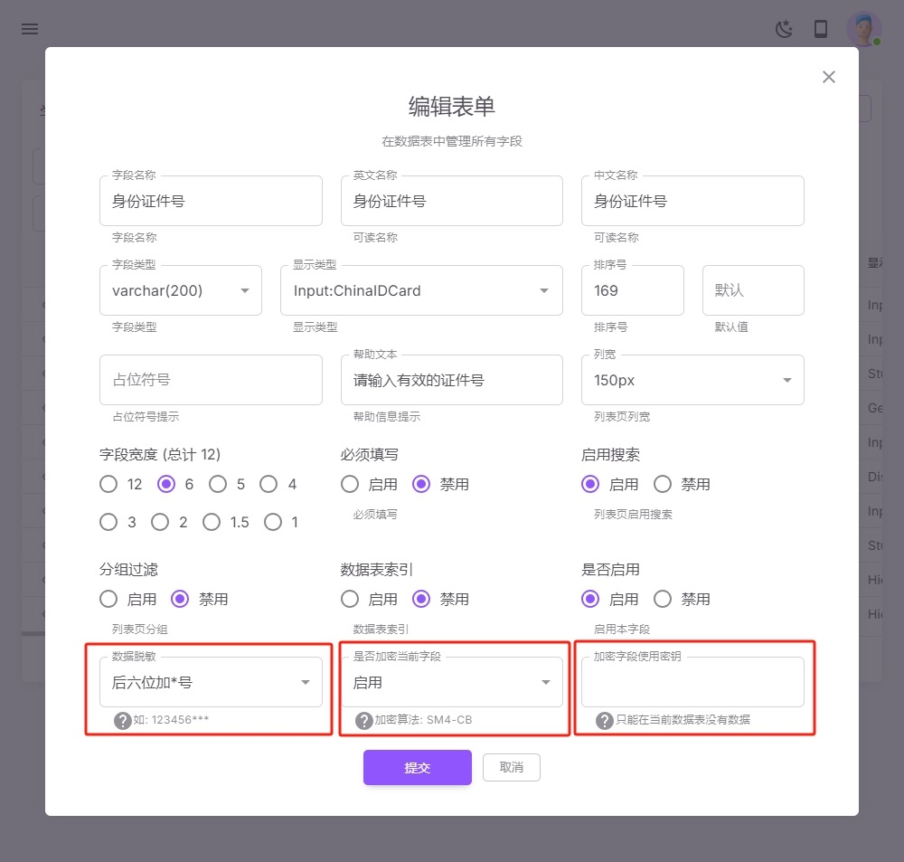
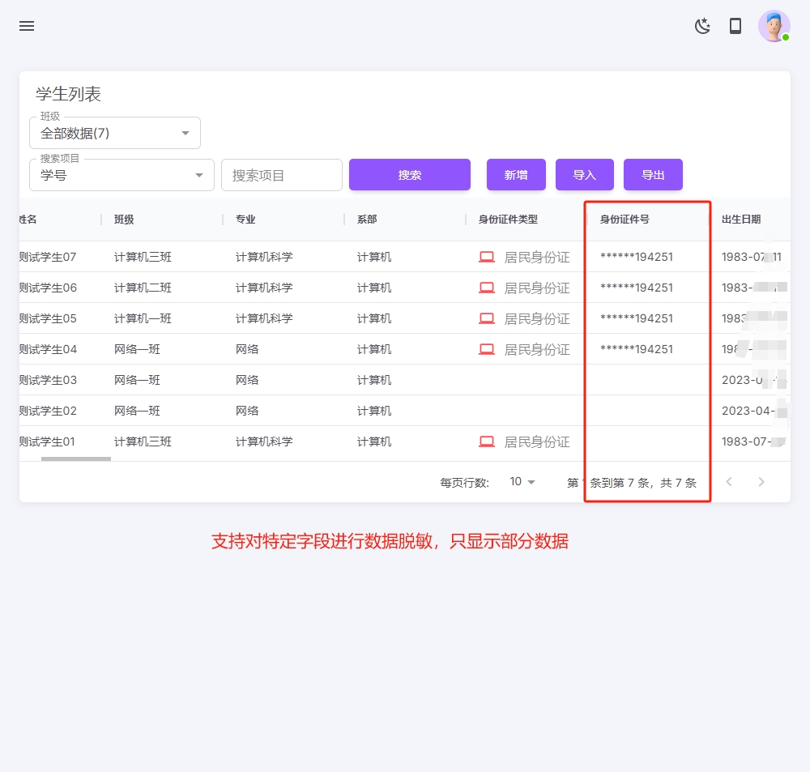
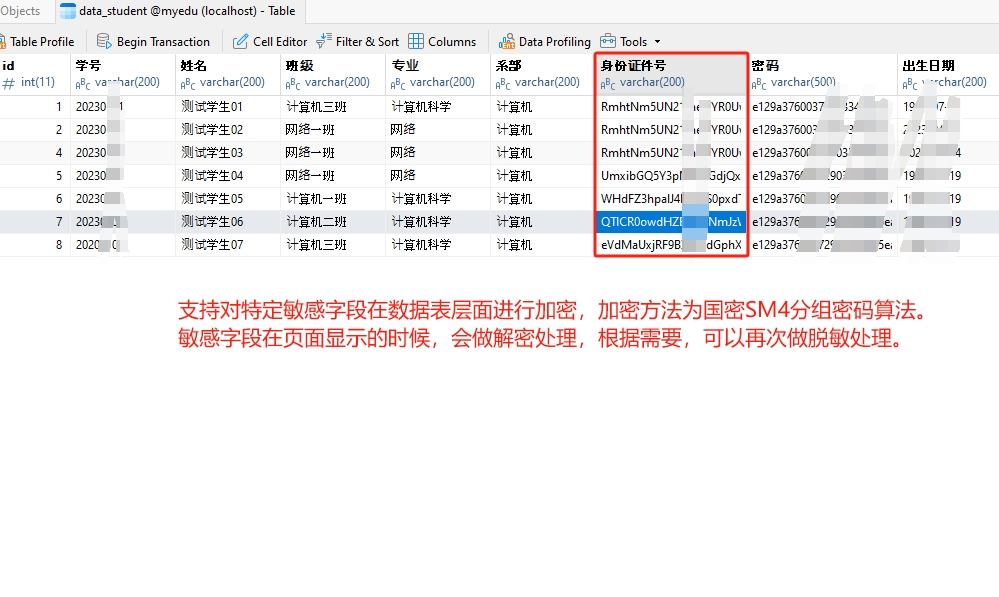
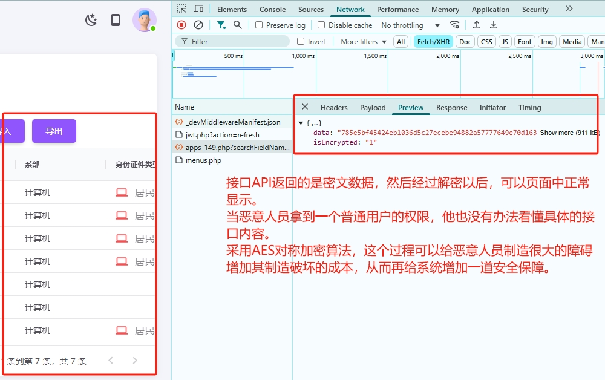

---
icon: bars
---

#### 系统安全

1. 安全编码实践
    遵循 OWASP（开放 Web 应用安全项目）指南，防范 SQL 注入、XSS（跨站脚本攻击）、CSRF（跨站请求伪造）等常见漏洞。
    采用输入验证与输出编码，防止恶意数据攻击。

2. 访问控制与权限管理
    实施最小权限原则（PoLP），确保用户和系统组件仅能访问必要的资源。
    使用 OAuth 2.0、JWT 或 SAML 进行身份验证和授权，保障访问安全。
    采用角色和权限管理系统，确保不同用户级别的数据访问控制。

3. 数据加密与存储安全
    支持对特定敏感字段在数据表层面进行加密，加密方法为国密SM4分组密码算法。
    敏感字段在页面显示的时候，会做解密处理，根据需要，可以再次做脱敏处理。
    采用 AES、RSA、SM4 等强加密算法对敏感数据进行存储和传输加密。
    确保数据库和日志文件不存储明文敏感信息，如用户密码等。

4. 数据通信安全
    采用HTTPS来加强数据通信过程的安全性。
    系统接口API返回的内容可以设定为密文，经过解密以后，可以页面中正常显示。
    当恶意人员拿到一个普通用户的权限，其也没有办法看懂具体的接口内容，这个过程可以给恶意人员制造很大的障碍增加其制造破坏的成本，从而再给系统增加一道安全保障。

5. 第三方依赖管理与漏洞修复
    使用 composer audit、npm audit 或 snyk 等工具，定期扫描第三方库的安全漏洞。
    避免使用不受维护的开源软件，定期更新依赖库以获取安全补丁。
    对第三方 API 进行严格的访问控制，如使用 API 密钥、OAuth 认证等方式。

|  |  |
|------------------------------------------|------------------------------------------|
|  |  |
|  |  |
