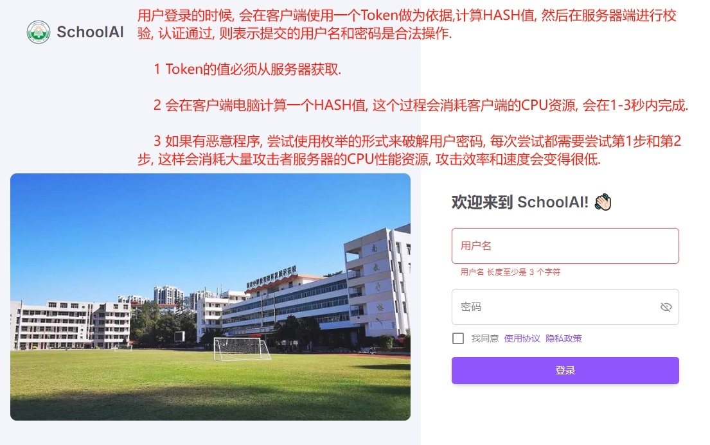
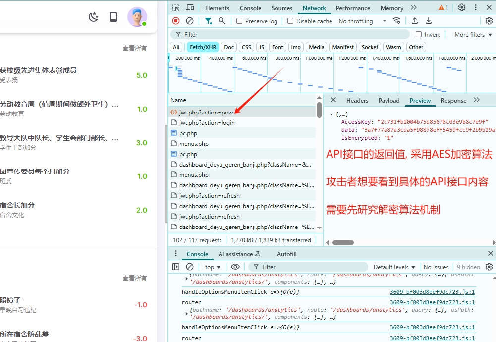
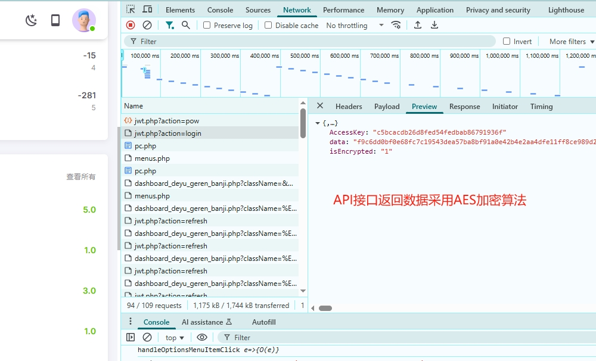

#### 用户登录安全

1. 客户端工作量证明机制
    用户登录的时候, 会在客户端使用一个从服务器端返回的一个Token做为依据,计算一个HASH值, 然后会在服务器端进行校验, 认证通过, 则表示提交的用户名和密码是合法操作, 否则会提示认证失败.
    
    特点: 

    1 Token的值必须从服务器获取.

    2 必须要在客户端的电脑计算一个HASH值, 该HASH值的要求前几位必须是0开头, 这个过程会消耗一些客户端的CPU计算资源, 大概会在1-3秒内完成, 普通用户使用的时候, 不会有额外的延迟感觉.

    3 如果有恶意程序, 尝试使用枚举的形式来破解用户密码, 每次尝试都需要尝试第1步和第2步, 这样会消耗大量攻击者服务器的CPU性能资源, 使得攻击效率和速度变得很低, 暴力破解成本变得很高.

2. IP访问控制

    同一IP, 密码错误次数过多, 会封禁IP一段时间.

3. 用户名访问控制

    某个用户的密码错误次数过多, 会封禁该用户一段时间.

4. 错误提示控制

    系统根据不同的情况, 会有10-20种不同的错误提示类别, 但对于用户来说, 只会显示一种错误提示: '用户名或密码错误', 显示固定的错误提示, 有助于迷惑攻击者, 从而让其很难猜测到真正的错误原因.

5. 数据传输控制

    服务器API返回的接口, 都通过AES加密算法进行加密, 这个是对称加密算法, 如果攻击者想要知道具体的API返回结果, 还需要去研究具体的解密机制, 再次给攻击者增加了很大的难度, 使其暴力破解的成本显著提高.

|  |  |
|------------------------------------------|------------------------------------------|
|  | |
