### 固定资产
#### 资产采购流程
以上流程仅为内置流程, 可以根据学校要求进行自由组合和调整流程.
| 步骤名称  | 下一步 | 转交下一步 | 主办说明 |
|-------|-----------|-------|----------|
| 第1步： 固定资产采购申请  | 2,3,4 | 可以提前设置下一步经办人的范围 | 支持  |
| 第2步： 行政部门负责人    | 5 | 可以提前设置下一步经办人的范围 | 支持  |
| 第3步： 系部分管审批    | 5 | 可以提前设置下一步经办人的范围 | 支持  |
| 第4步： 系部主管审批    | 5 | 可以提前设置下一步经办人的范围 | 支持  |
| 第5步： 教学类审批        | 6 | 可以提前设置下一步经办人的范围 | 支持  |
| 第6步： 校长审批          | 7 | 可以提前设置下一步经办人的范围 | 支持  |
| 第7步： 总务资产员确认    | 8 | 可以提前设置下一步经办人的范围 | 支持  |
| 第8步： 总务处负责人审批   | 9 | 可以提前设置下一步经办人的范围 | 支持  |
| 第9步： 采购员入库        | 10 | 可以提前设置下一步经办人的范围 | 支持  |
| 第10步： 行政后勤类审批   | 11 | 可以提前设置下一步经办人的范围 | 支持  |
| 第11步： 财务处知悉       | [结束] | 可以提前设置下一步经办人的范围 | 支持  |

注意:
1 资产采购申请流程可以根据学校的要求进行自定义.
2 资产采购员入库的时候, 可以设置供应商信息, 采购状态和购买方式.
3 资产采购员也可以在"后勤管理->固定资产->资产采购"的菜单中设置资产采购中的采购状态.
4 <B>当采购状态变成"采购完成"的时候, 就可以再单独发起一个资产入库流程, 来完成资产入库.</B>

| 系统截图  | 系统截图 |
|-------|-----------|
| 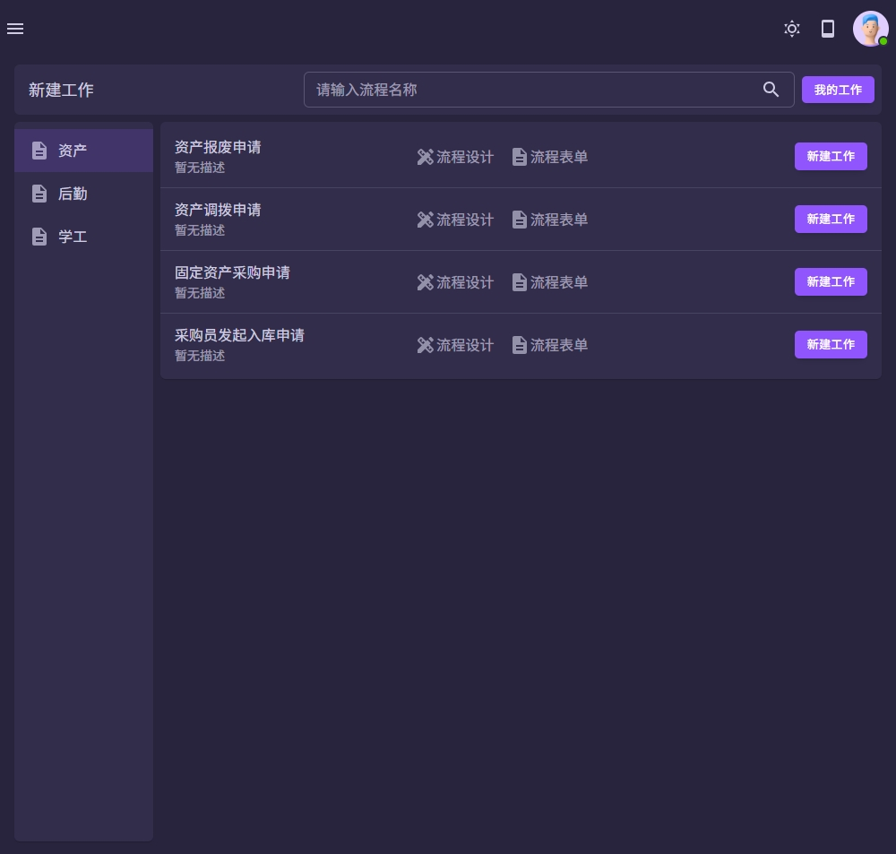 | 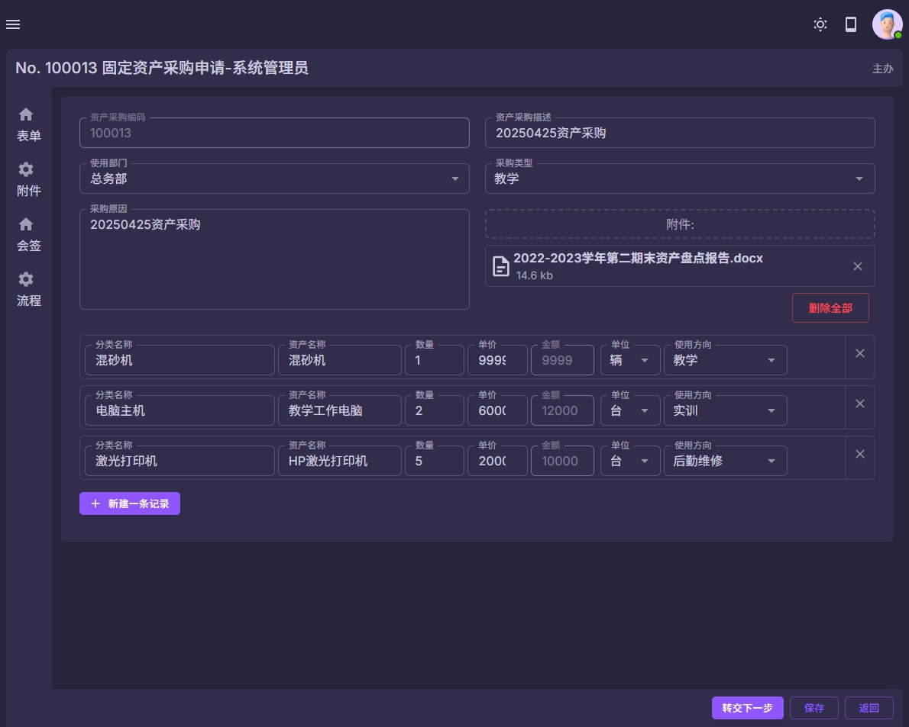 |
| 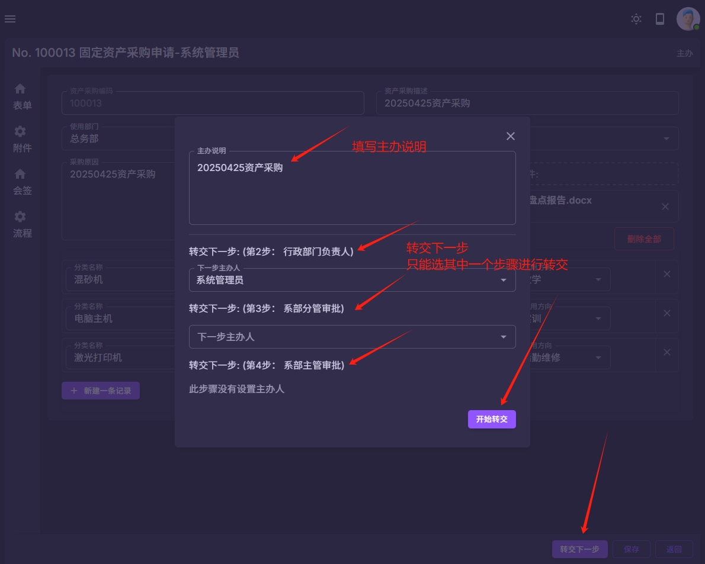 | 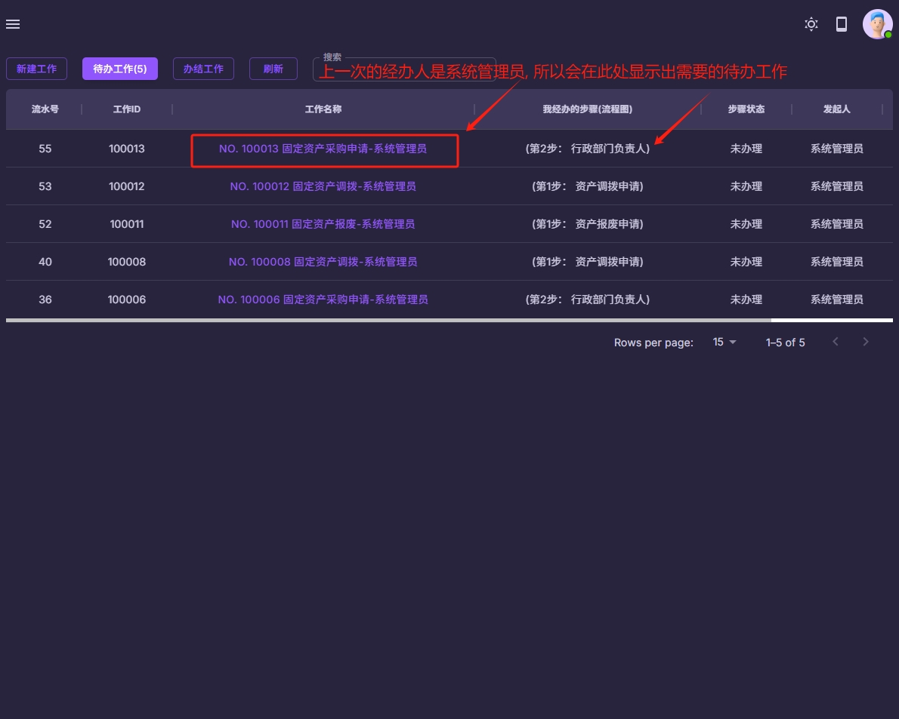 |
| 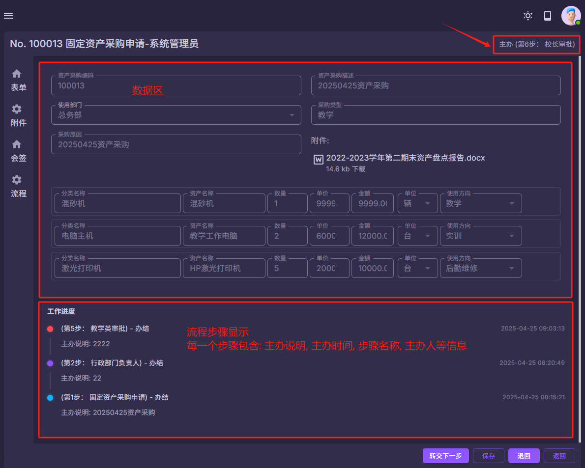 | 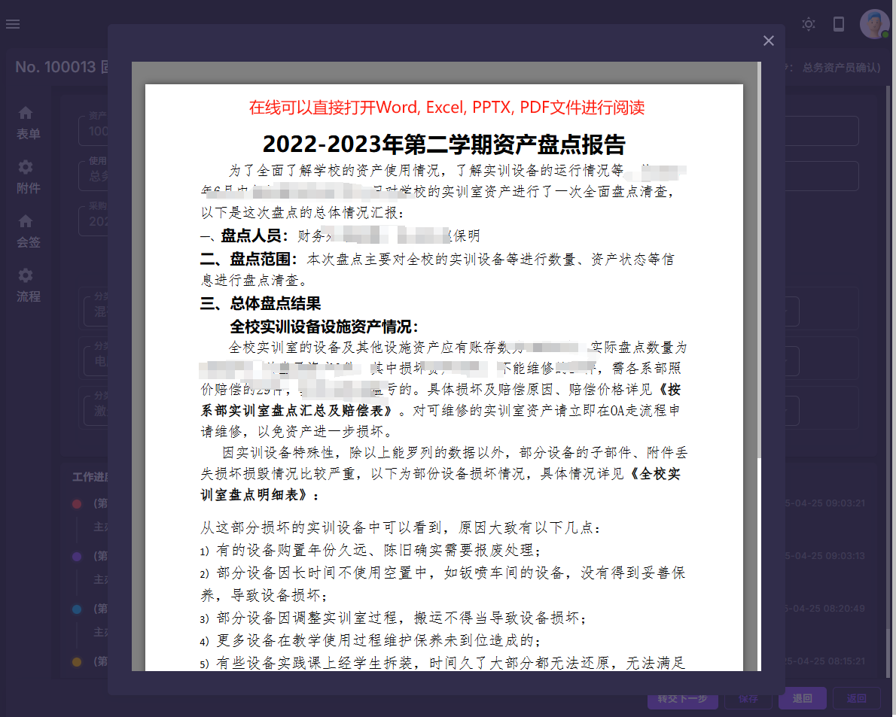 |
| 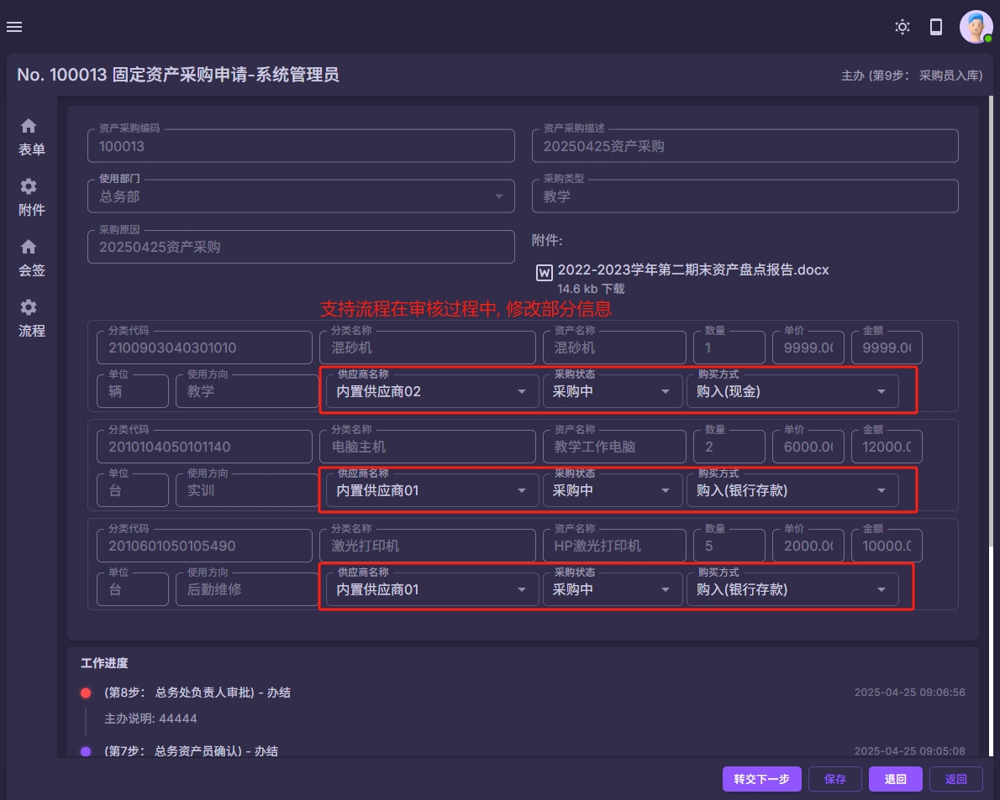 | 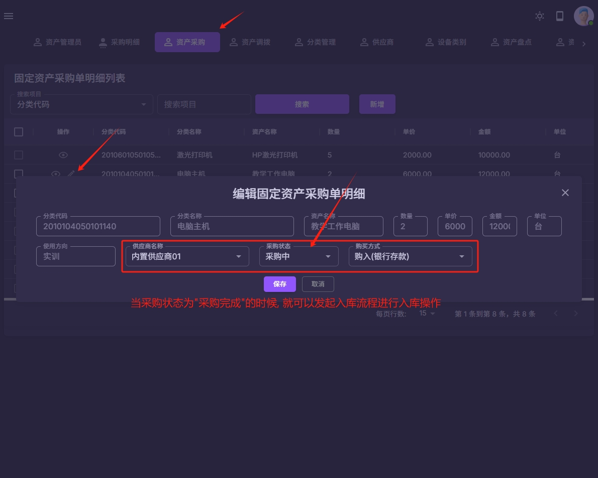 |
| 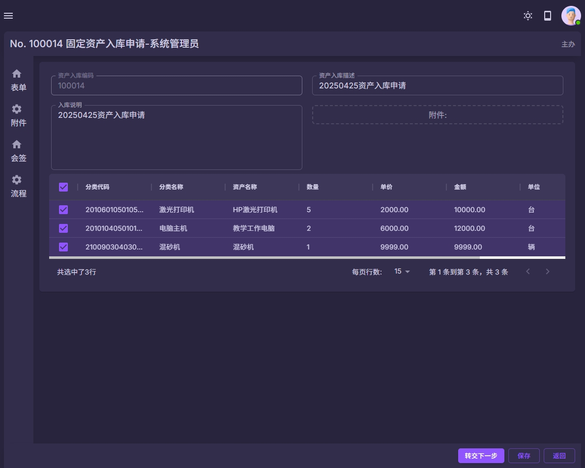 | 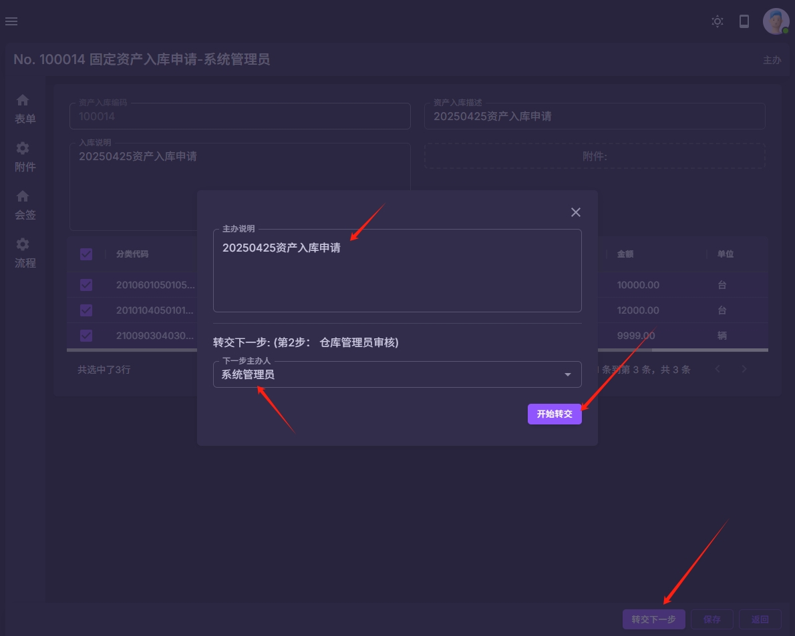 |
| 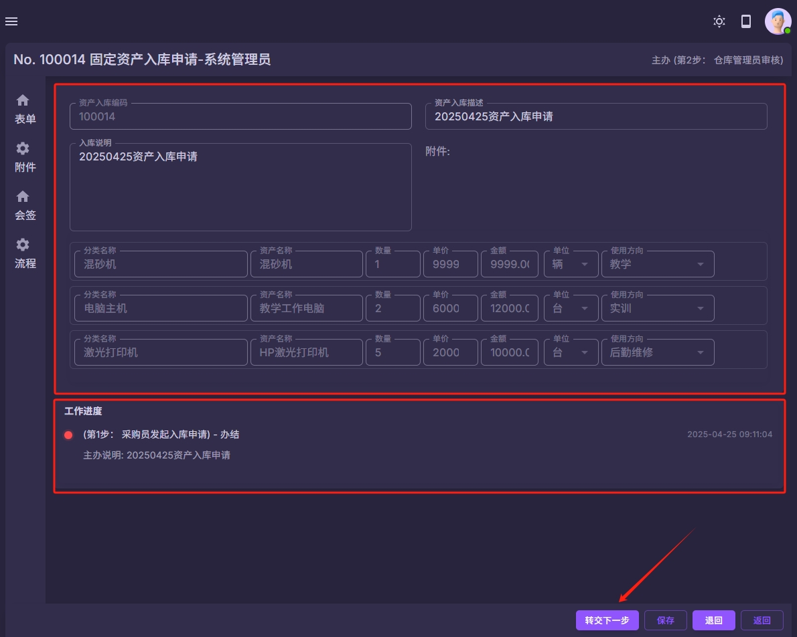 | 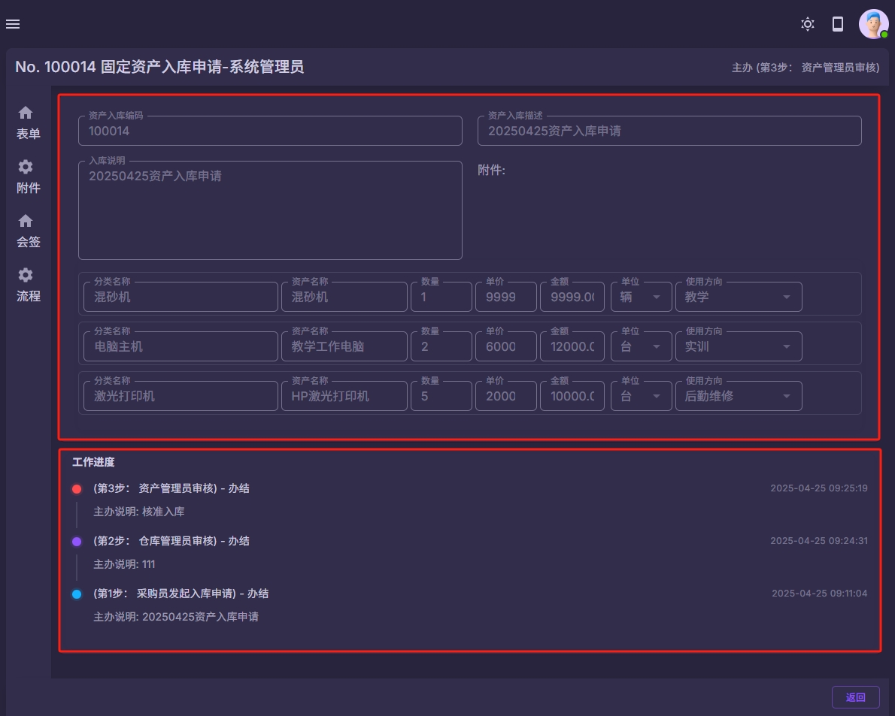 |
| 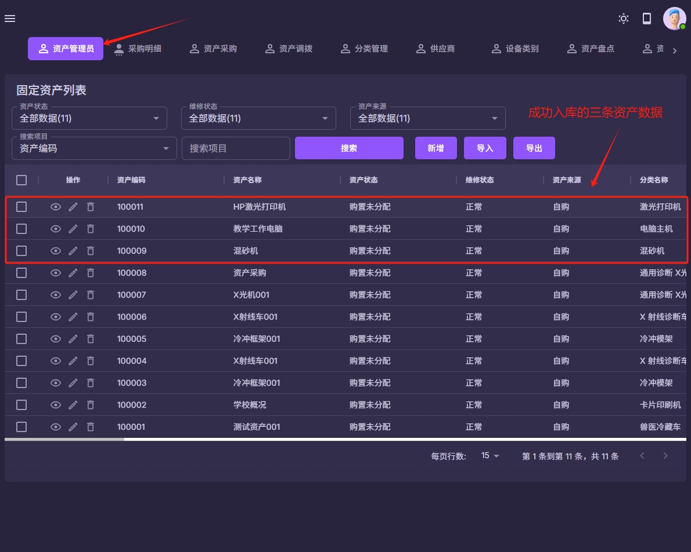 |  |