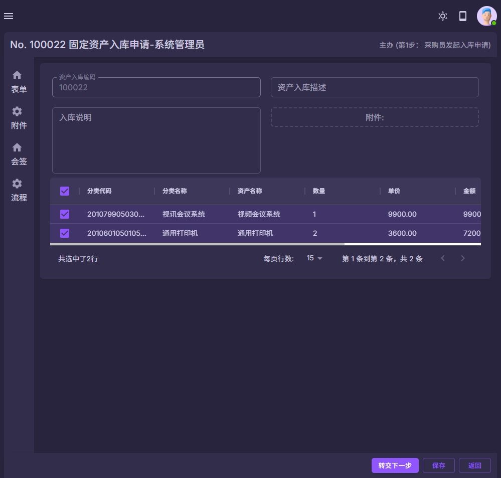
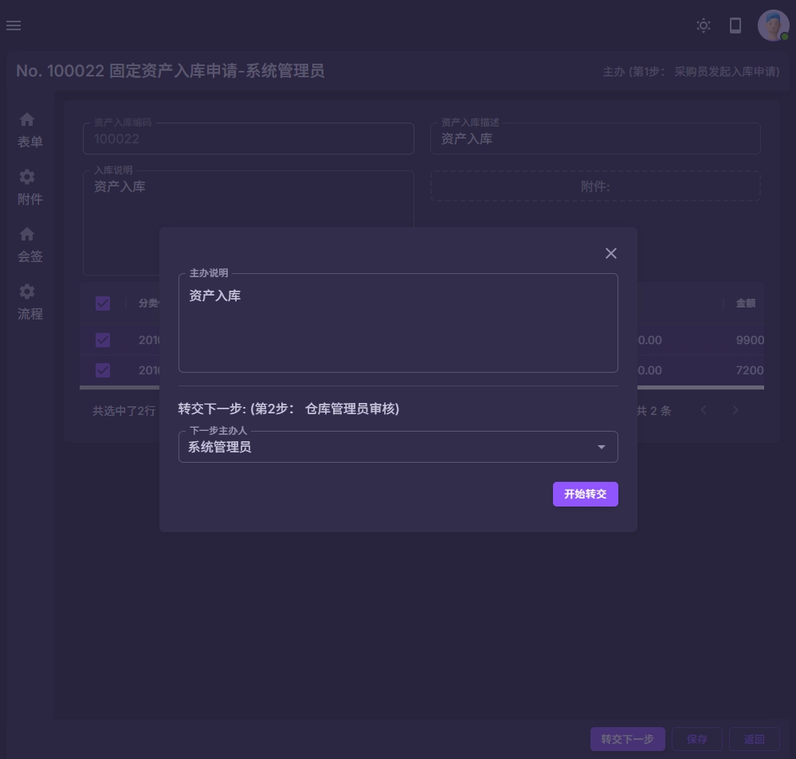
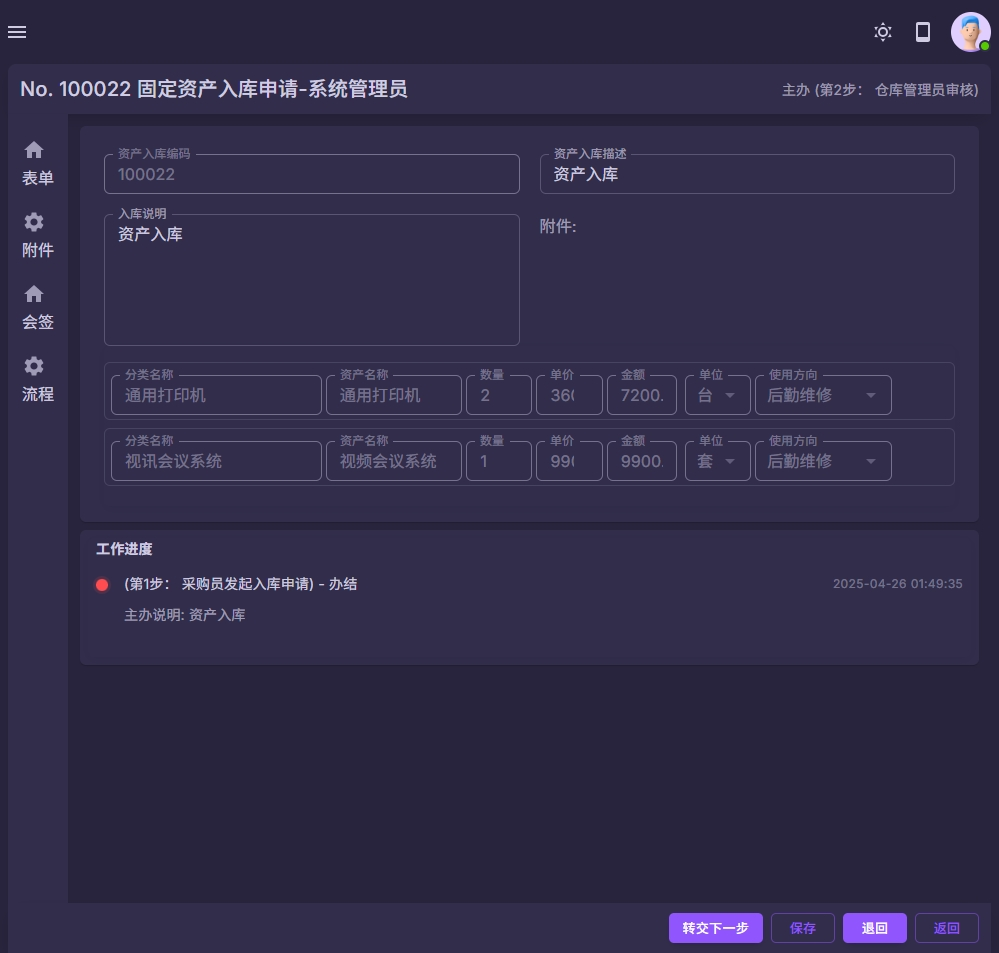
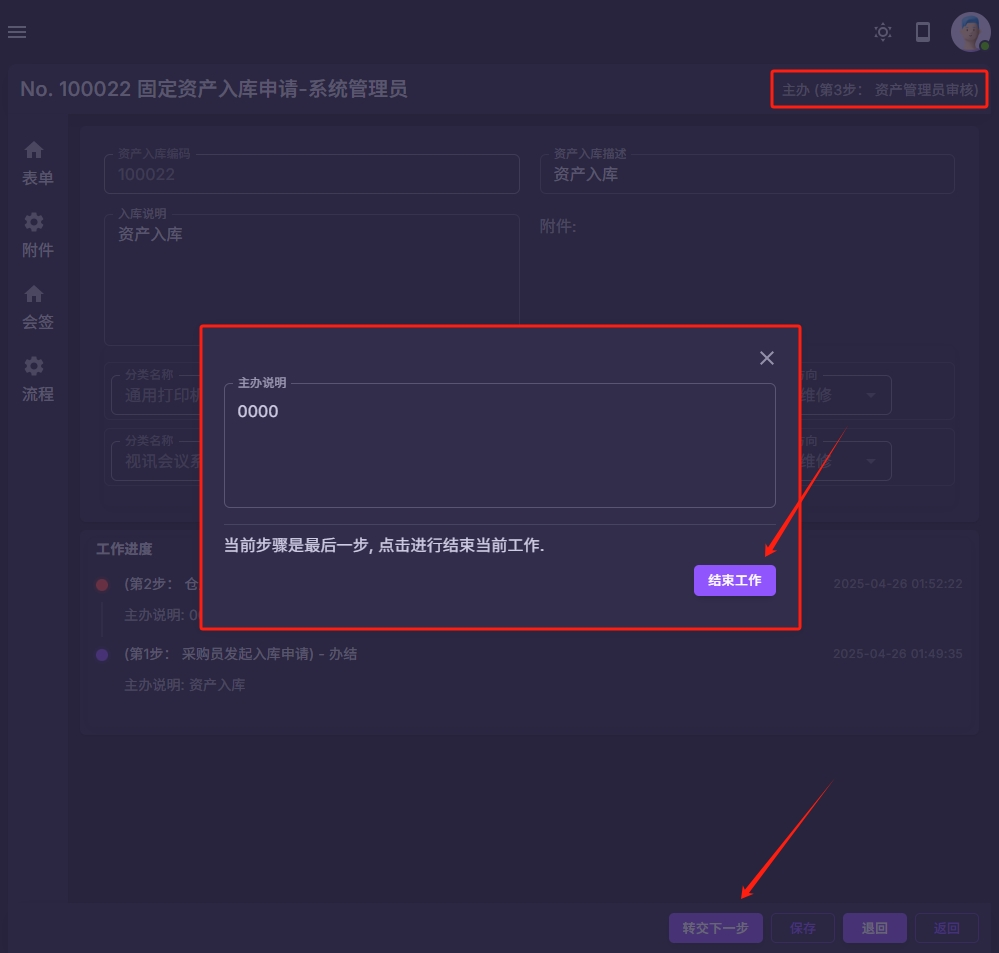

### 固定资产
#### 资产报废流程
以上流程仅为内置流程, 可以根据学校要求进行自由组合和调整流程.

| 步骤名称  | 下一步 | 转交下一步 | 主办说明 |
|-------|-----------|-------|----------|
| 第1步： 资产报废申请      | 2 | 可以提前设置下一步经办人的范围 | 支持  |
| 第2步： 部门负责人确认    | 3 | 可以提前设置下一步经办人的范围 | 支持  |
| 第3步： 仓库管理员审核    | 4,5,6 | 可以提前设置下一步经办人的范围 | 支持  |
| 第4步： 总务处审核        | 7 | 可以提前设置下一步经办人的范围 | 支持  |
| 第5步： 信息中心审核      | 4 | 可以提前设置下一步经办人的范围 | 支持  |
| 第6步： 分管领导审核      | 4 | 可以提前设置下一步经办人的范围 | 支持  |
| 第7步： 财务处确认        | 8 | 可以提前设置下一步经办人的范围 | 支持  |
| 第8步： 校长批示          | [结束] | 可以提前设置下一步经办人的范围 | 支持  |

注意:
1 资产报废申请流程可以根据学校的要求进行自定义.
2 资产报废界面中列出来记录为资产模块的数据.
3 资产报废申请通过以后, 会在资产信息修改该资产为报废状态.
4 管理员也可以在"后勤管理->固定资产->报废明细"的菜单中查看所有明细.
| 系统截图  | 系统截图 |
|-------|-----------|
|  |  |
|  |  |