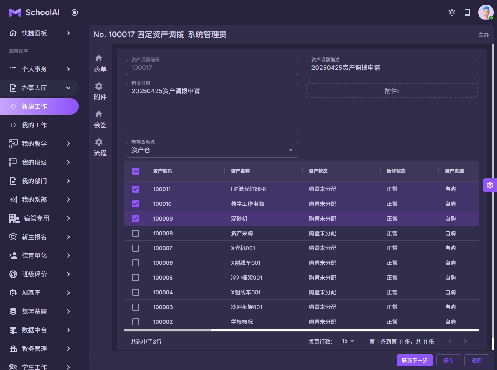

### 固定资产
#### 资产调拨流程
以上流程仅为内置流程, 可以根据学校要求进行自由组合和调整流程.

| 步骤名称  | 下一步 | 转交下一步 | 主办说明 |
|-------|-----------|-------|----------|
| 第1步： 资产调拨申请      | 2 | 可以提前设置下一步经办人的范围 | 支持  |
| 第2步： 部门负责人确认    | 3 | 可以提前设置下一步经办人的范围 | 支持  |
| 第3步： 仓库管理员审核    | 4 | 可以提前设置下一步经办人的范围 | 支持  |
| 第4步： 财务处知悉        | [结束] | 可以提前设置下一步经办人的范围 | 支持  |

注意:
1 资产调拨申请流程可以根据学校的要求进行自定义.
2 资产调拨界面中列出来记录为资产模块的数据.
3 资产调拨主要修改的存放地点, 暂时不涉及所属人员或部门.
4 管理员也可以在"后勤管理->固定资产->调拨明细"的菜单中查看所有明细.

| 系统截图  | 系统截图 |
|-------|-----------|
|  |  |
|  |  |