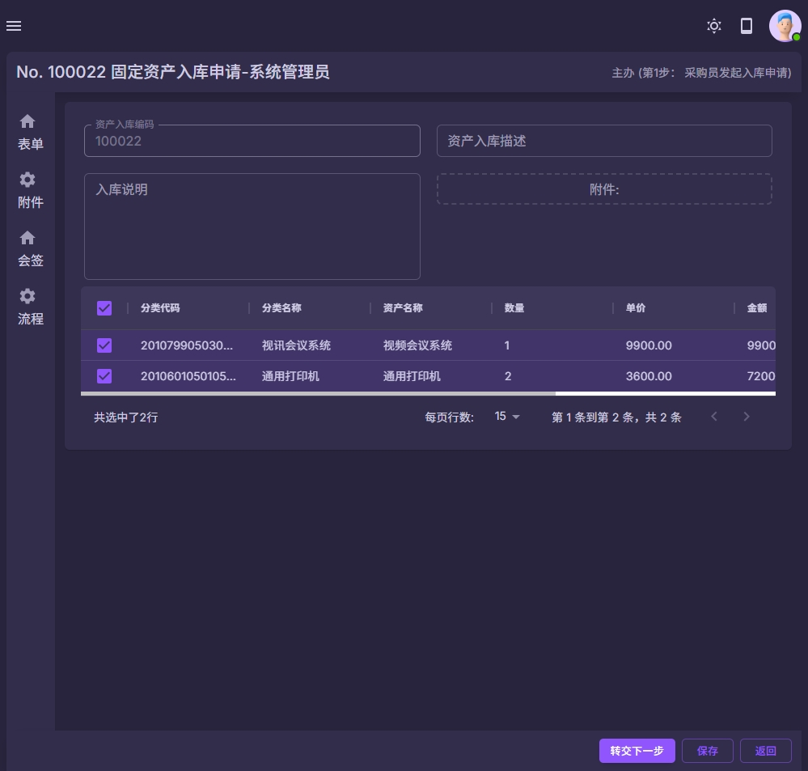
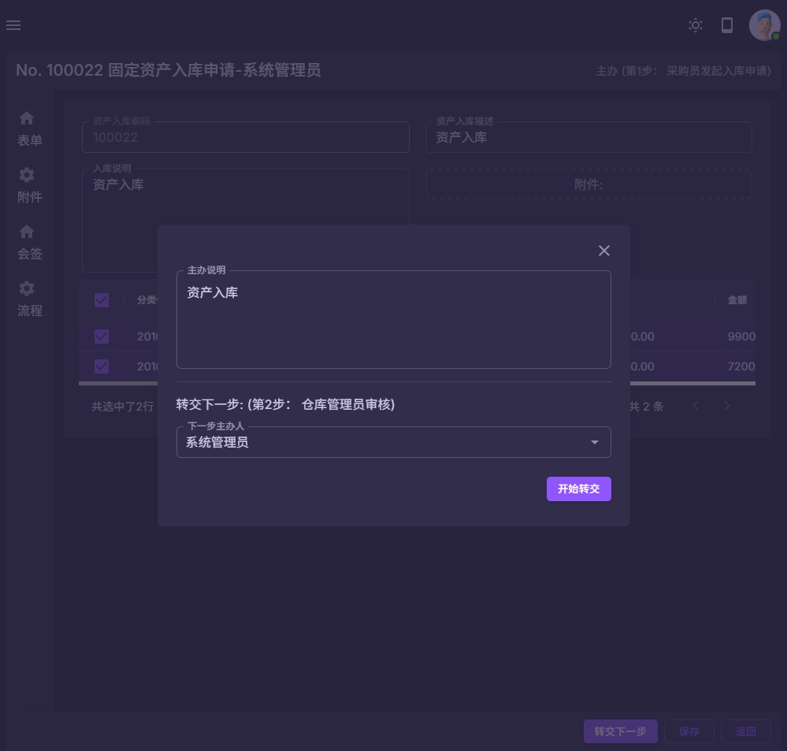
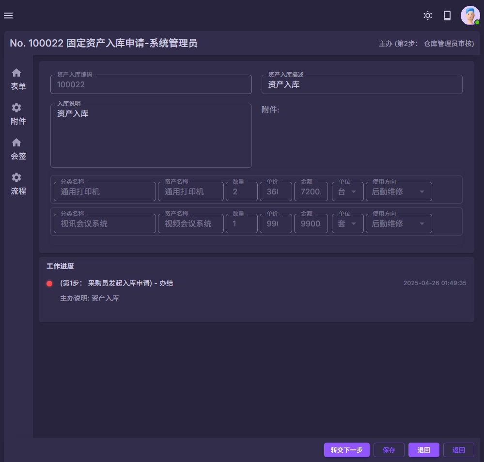
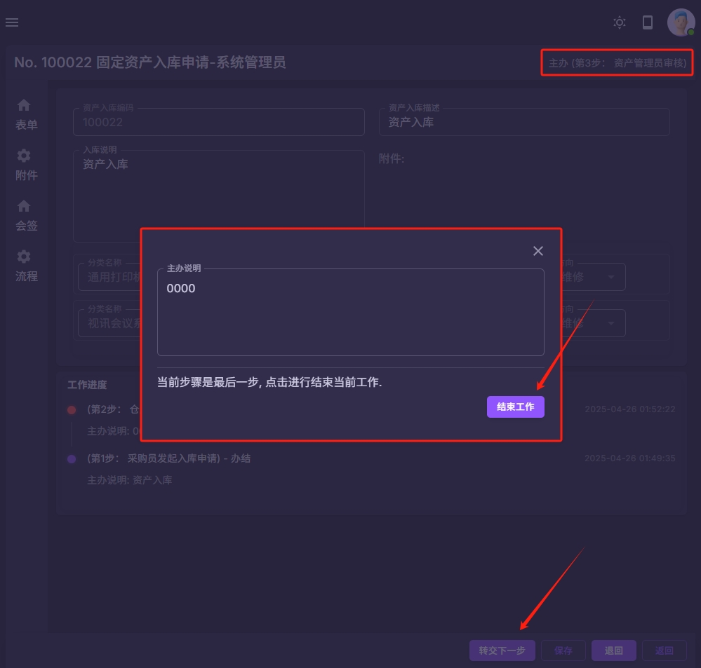

### 固定资产
#### 资产入库流程
以上流程仅为内置流程, 可以根据学校要求进行自由组合和调整流程.

| 步骤名称  | 下一步 | 转交下一步 | 主办说明 |
|-------|-----------|-------|----------|
| 第1步： 采购员发起入库申请  | 2 | 可以提前设置下一步经办人的范围 | 支持  |
| 第2步： 仓库管理员审核    | 3 | 可以提前设置下一步经办人的范围 | 支持  |
| 第3步： 资产管理员审核    | [结束] | 可以提前设置下一步经办人的范围 | 支持  |

注意:
1 资产入库申请流程可以根据学校的要求进行自定义.
2 资产采购明细中采购状态变成"采购完成"的记录, 才可以用于入库操作.
3 资产采购明细中的记录, 在完成入库操作的时候, 会自动把数据转入资产模块.
4 管理员也可以在"后勤管理->固定资产->入库明细"的菜单中查看所有明细.

| 系统截图  | 系统截图 |
|-------|-----------|
|  |  |
|  |  |