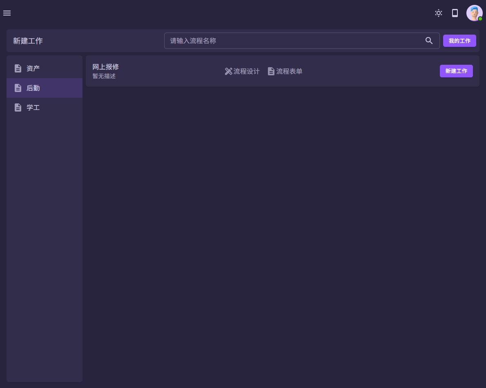
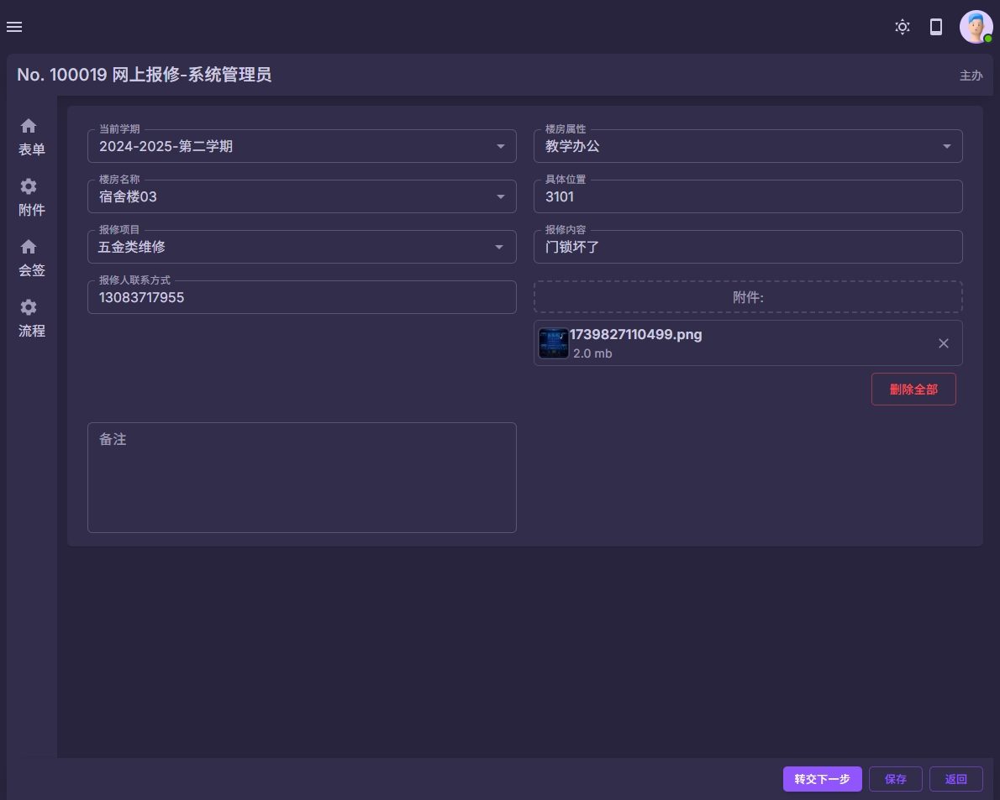
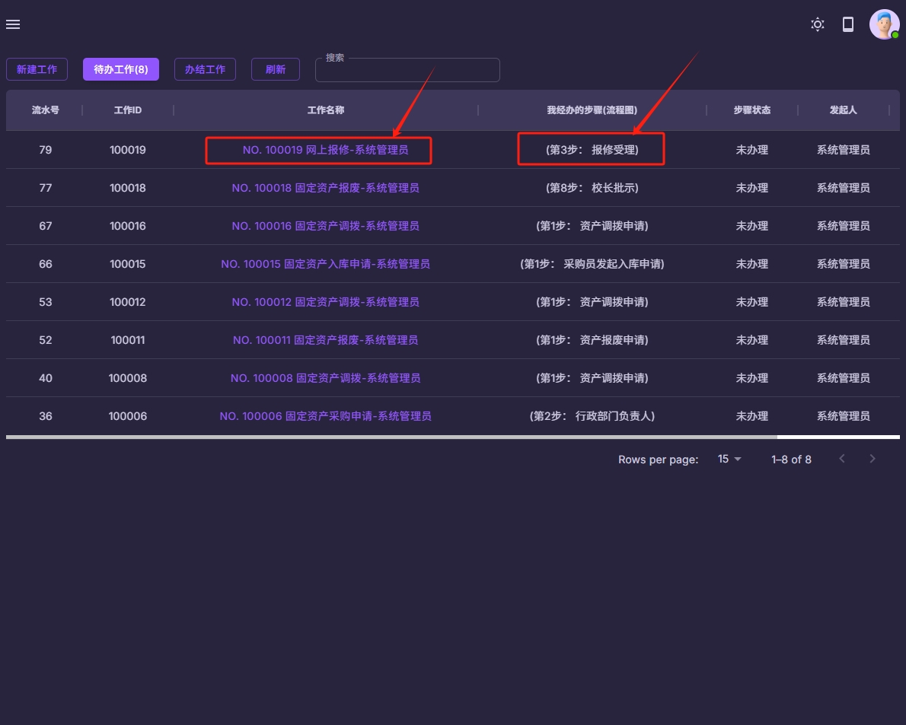
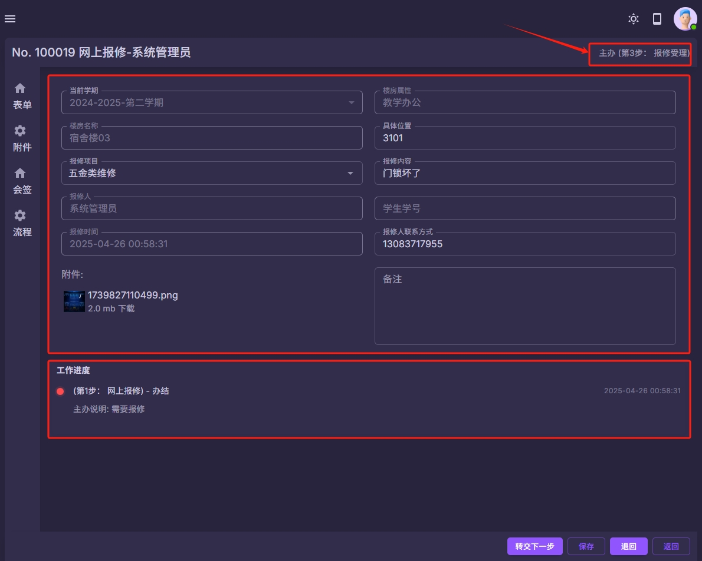

### 固定资产
#### 资产报废流程
以上流程仅为内置流程, 可以根据学校要求进行自由组合和调整流程.

| 教职工网上报修  | 下一步 | 转交下一步 | 主办说明 |
|-------|-----------|-------|----------|
| 第1步： 网上报修      | 2 | 可以提前设置下一步经办人的范围 | 支持  |
| 第2步： 宿管员审核    | 3 | 可以提前设置下一步经办人的范围 | 支持  |
| 第3步： 报修受理      | 4 | 可以提前设置下一步经办人的范围 | 支持  |
| 第4步： 维修组长派单  | 5 | 可以提前设置下一步经办人的范围 | 支持  |
| 第5步： 确认维修      | 6 | 可以提前设置下一步经办人的范围 | 支持  |
| 第6步： 服务评价      | 7 | 可以提前设置下一步经办人的范围 | 支持  |
| 第7步： 报修信息      | [结束] | 可以提前设置下一步经办人的范围 | 支持  |

| 学生网上报修  | 下一步 | 转交下一步 | 主办说明 |
|-------|-----------|-------|----------|
| 第8步： 报修信息      | 2 | 当前步骤仅限学生使用 | 支持  |
| 第2步： 宿管员审核    | 3 | 可以提前设置下一步经办人的范围 | 支持  |
| 第3步： 报修受理      | 4 | 可以提前设置下一步经办人的范围 | 支持  |
| 第4步： 维修组长派单  | 5 | 可以提前设置下一步经办人的范围 | 支持  |
| 第5步： 确认维修      | 6 | 可以提前设置下一步经办人的范围 | 支持  |
| 第6步： 服务评价      | 7 | 可以提前设置下一步经办人的范围 | 支持  |
| 第7步： 报修信息      | [结束] | 可以提前设置下一步经办人的范围 | 支持  |

注意:
1 网上报修流程可以根据学校的要求进行自定义.
2 老师和学生均可以发起网上报修流程.

| 系统截图  | 系统截图 |
|-------|-----------|
|  |  |
|  |  |