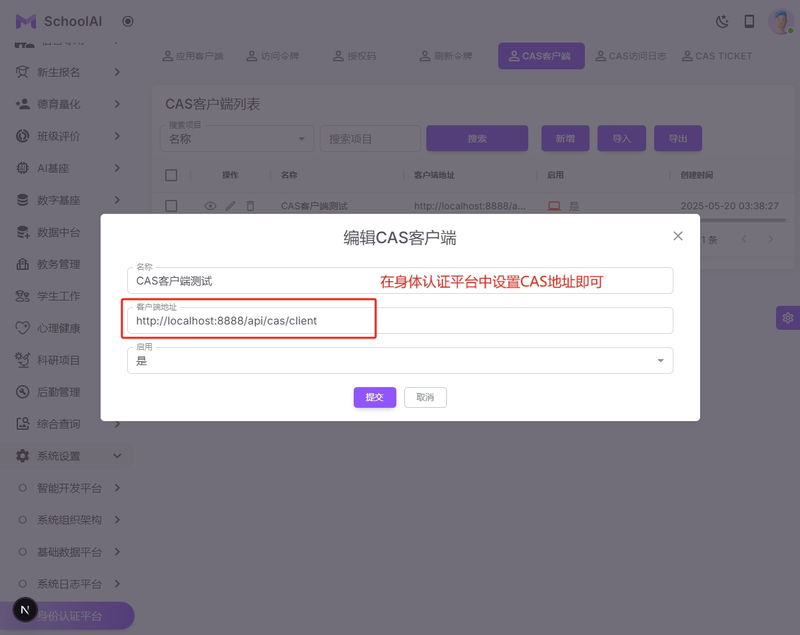
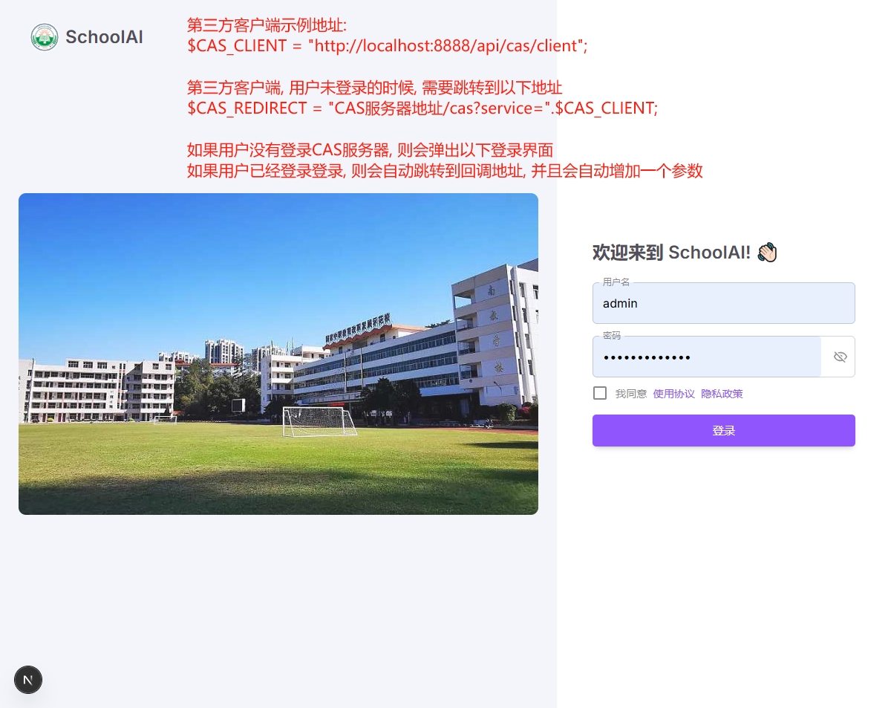
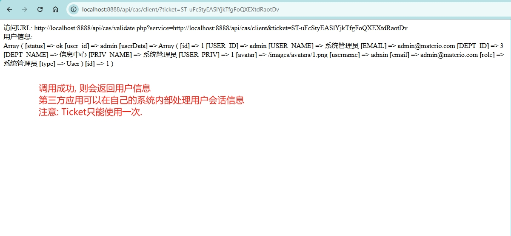

### SchoolAI 统一身份认证系统
#### 第三方应用客户端集成CAS Demo演示程序

PHP代码: https://github.com/SmartSchoolAI/SchoolDataCenter/tree/main/htdocs/api/cas/client
流程说明: 

第三方客户端示例地址:
$CAS_CLIENT = "http://localhost:8888/api/cas/client";

第三方客户端, 用户未登录的时候, 需要跳转到以下地址
$CAS_REDIRECT = "https://demoapi.dandian.net/cas?service=".$CAS_CLIENT;

如果用户没有登录CAS服务器, 则会弹出以下登录界面
如果用户已经登录登录, 则会自动跳转到回调地址, 并且会自动增加一个ticket参数

第三方客户端在拿到ticket参数以后, 再加上第三方客户端的地址, 进行API接口调用来获取用户信息

#### API 接口说明
##### validate.php
作用：把ticket转为用户信息
URL: https://demoapi.dandian.net/api/cas/validate.php
方法：GET
返回：[ 'id' => $id, .... ];
Demo PHP Code: https://github.com/SmartSchoolAI/SchoolDataCenter/blob/main/htdocs/api/cas/validate.php

| 系统截图  | 系统截图 |
|-------|-----------|
|  |  |
|  |  |