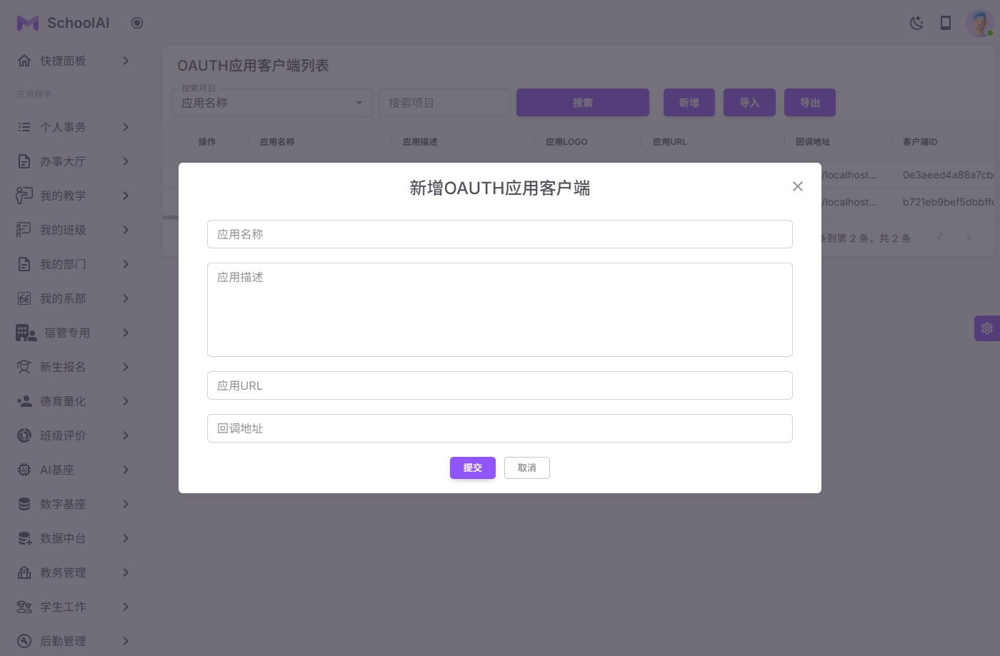
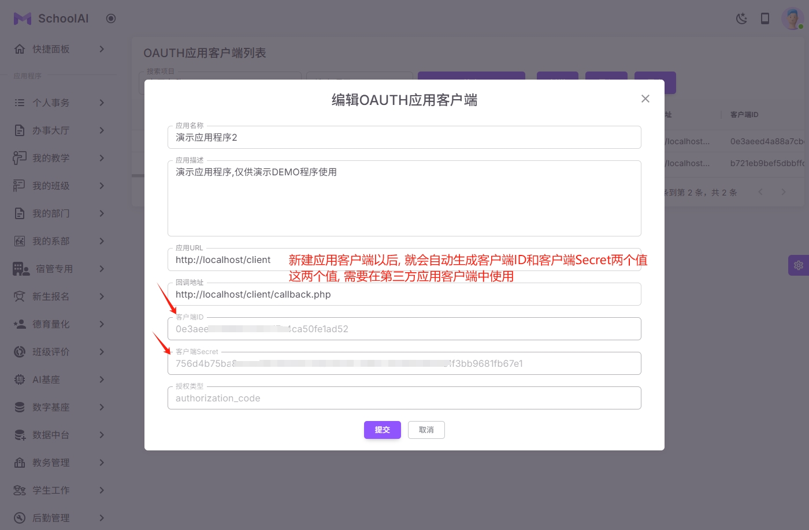
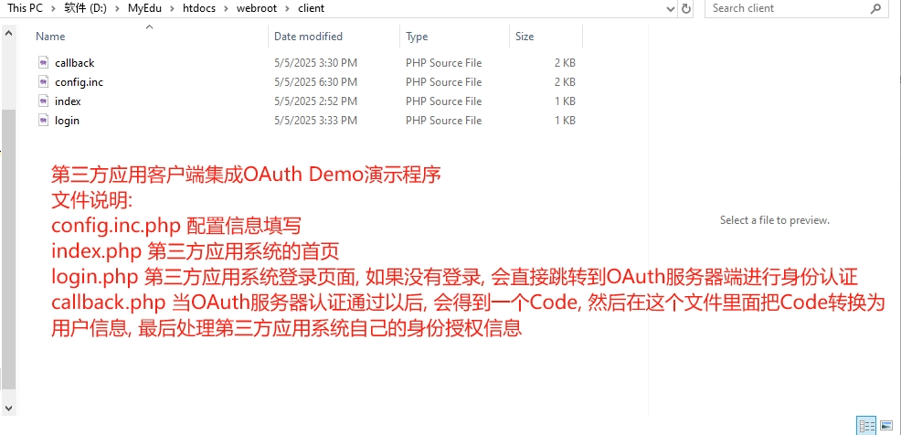
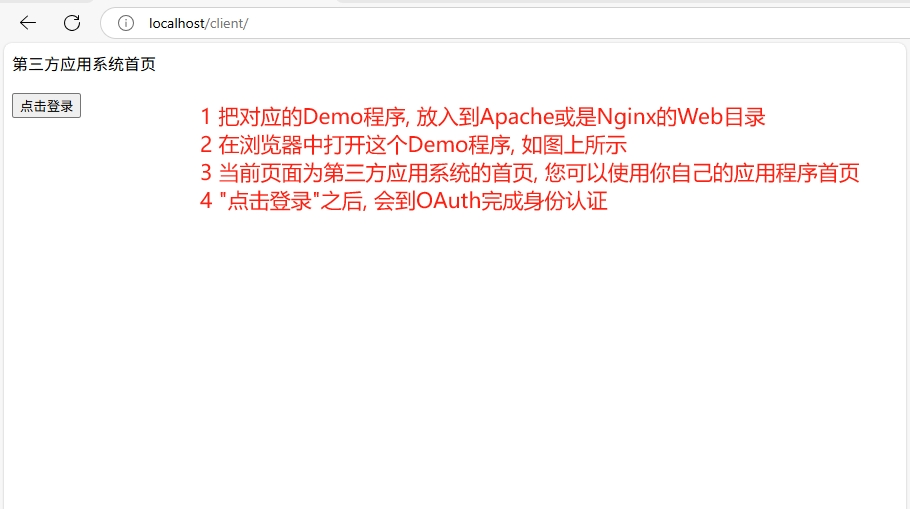
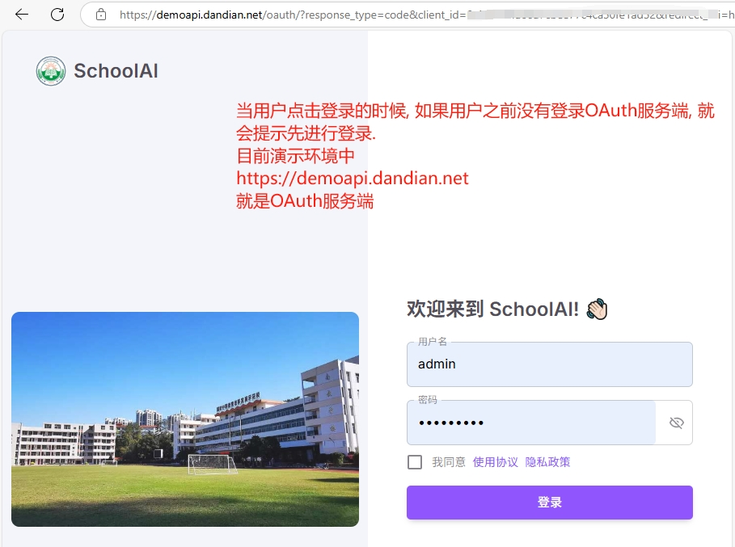
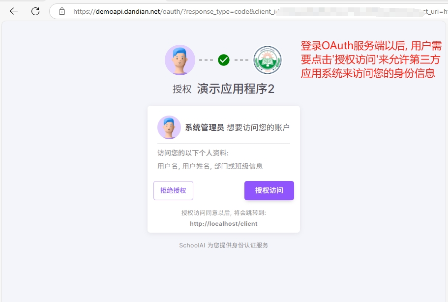
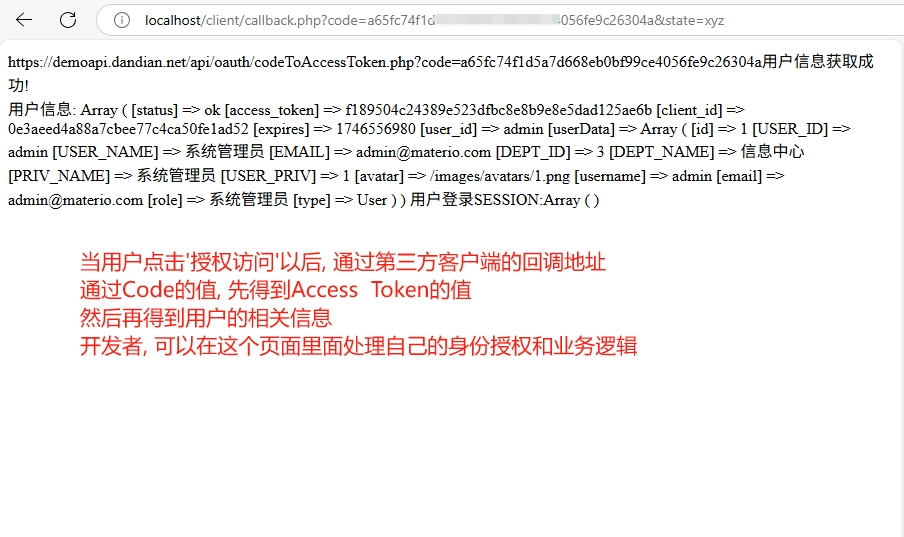

### SchoolAI 统一身份认证系统
#### 第三方应用客户端集成OAuth Demo演示程序

PHP代码: https://github.com/SmartSchoolAI/SchoolDataCenter/tree/main/htdocs/api/oauth/client
代码说明:
config.inc.php 配置信息填写
index.php 第三方应用系统的首页
login.php 第三方应用系统登录页面, 如果没有登录, 会直接跳转到OAuth服务器端进行身份认证
callback.php 当OAuth服务器认证通过以后, 会得到一个Code, 然后在这个文件里面把Code转换为用户信息, 最后处理第三方应用系统自己的身份授权信息

| 系统截图  | 系统截图 |
|-------|-----------|
|  |  |
|  |  |
|  |  |
|  |  |
|  | |