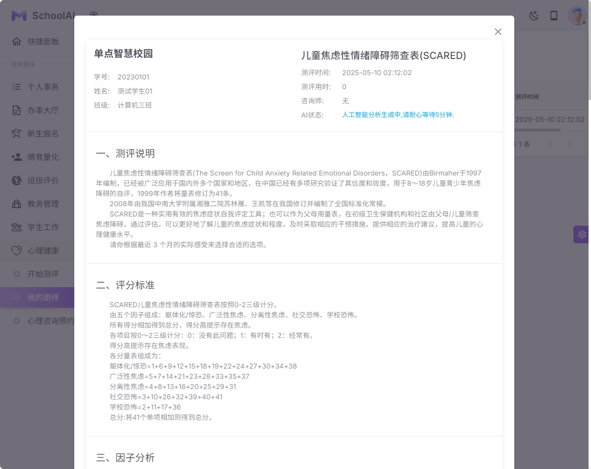

### 心理健康测评
#### 支持的心理健康测评模型
1 中学生心理健康量表(MSSMHS)
2 症状自评量表(SCL-90)
3 中学生学科兴趣测评
4 中小学生心理健康量表(MHT)
5 儿童焦虑性情绪障碍筛查表(SCARED)
6 根据学校需要, 可以增加其它模型量表

#### 主要功能
1 测评项目
2 模拟测评
3 测试记录
4 测评结果

#### 主要流程
1 学生参与心理测评
2 等待5-10分钟以后, AI(DeepSeek模型)会生成相关的心理健康测评报告
3 老师如果想体验测评功能, 可以在'模拟测评'菜单中体现

| 系统截图  | 系统截图 |
|-------|-----------|
|  |  |
|  |  |
|  |  |
|  |  |
|  |  |
|  |  |
