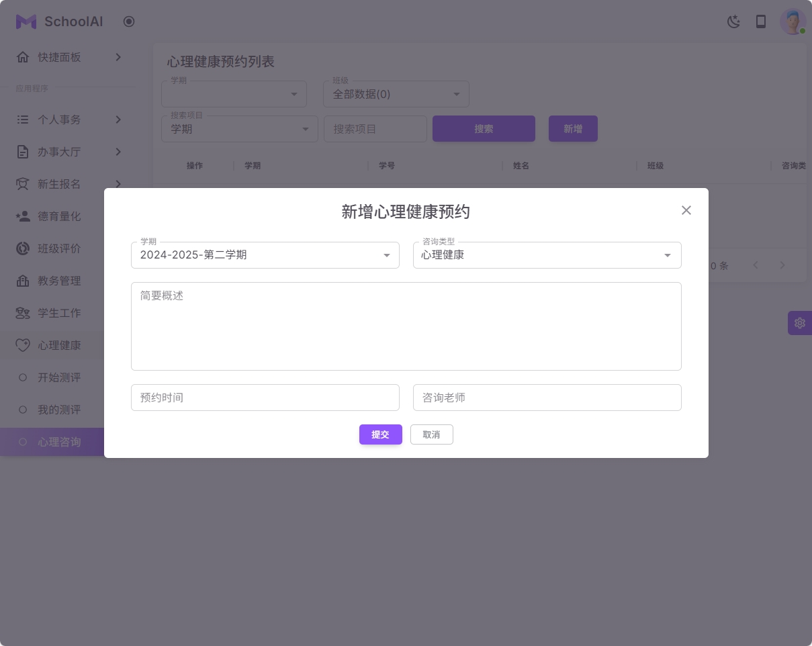
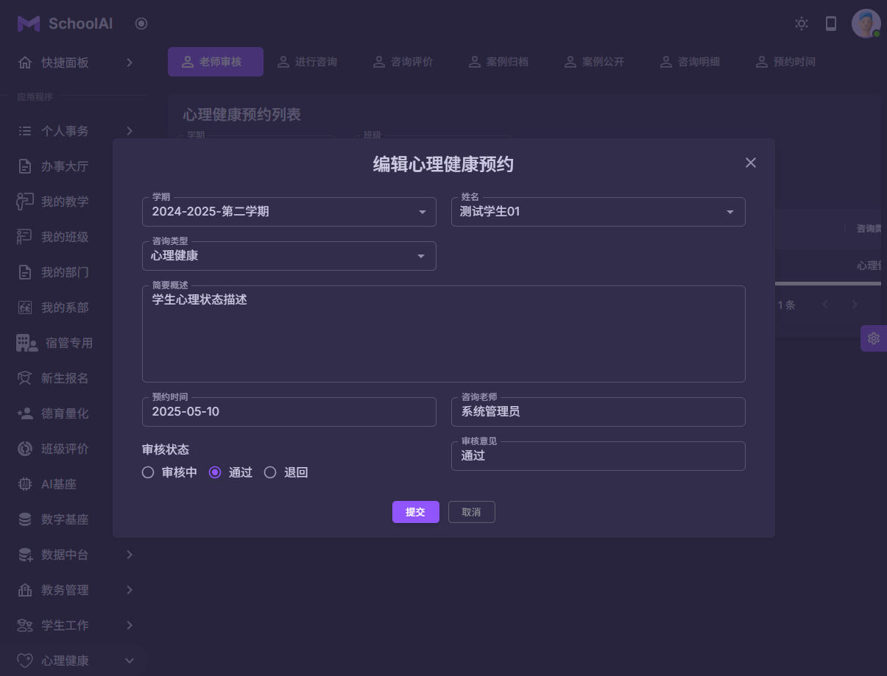
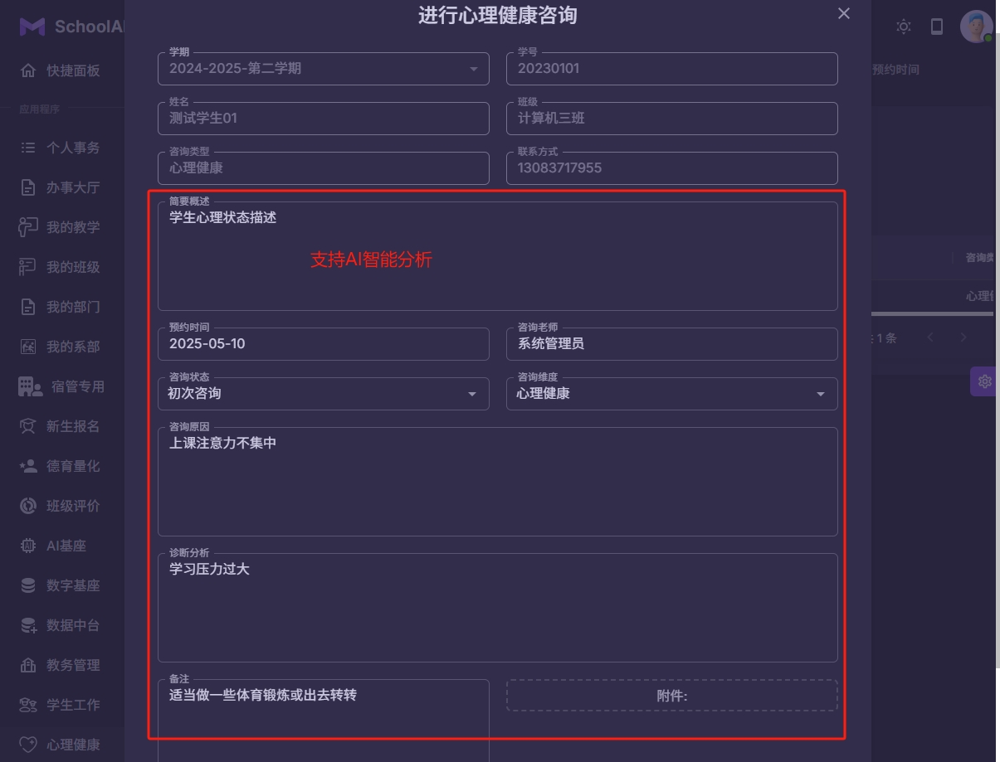
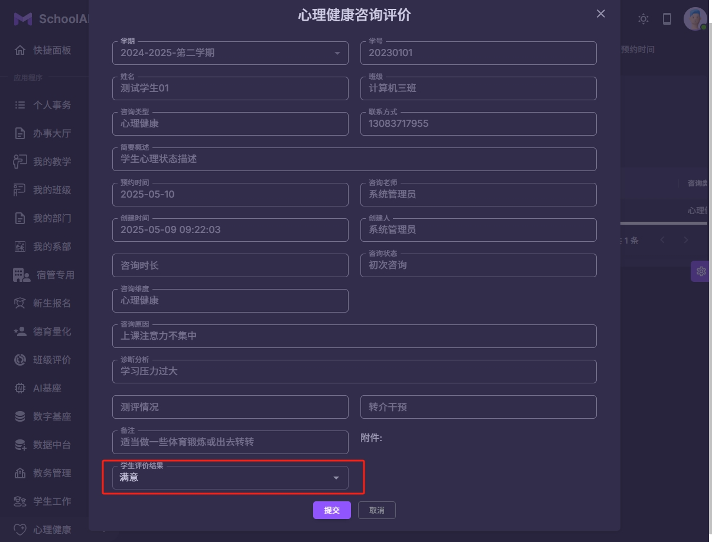
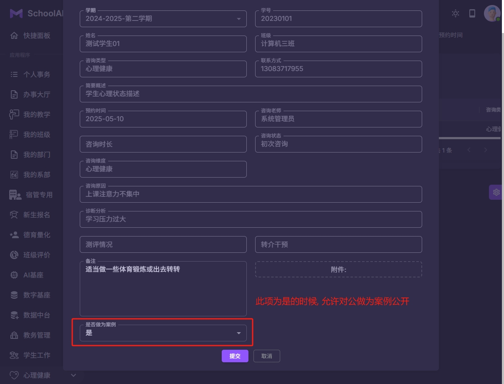
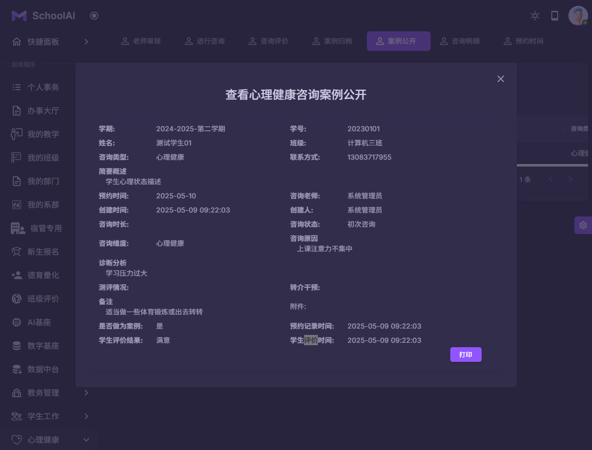
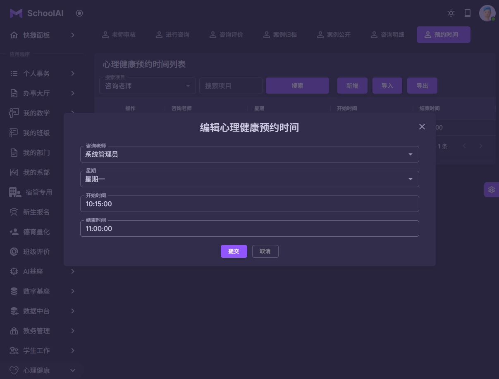

### 心理健康预约咨询
#### 主要流程
1 学生发起预约
2 心理咨询老师审核预约申请
3 心理咨询老师进行心理健康咨询
4 学生对心理健康咨询进行评价
5 管理员对心理健康咨询的记录设置是否做为公开案例
6 可以设置独立的心理健康咨询预约时间

| 系统截图  | 系统截图 |
|-------|-----------|
|  |  |
|  |  |
|  |  |
|  |  |
