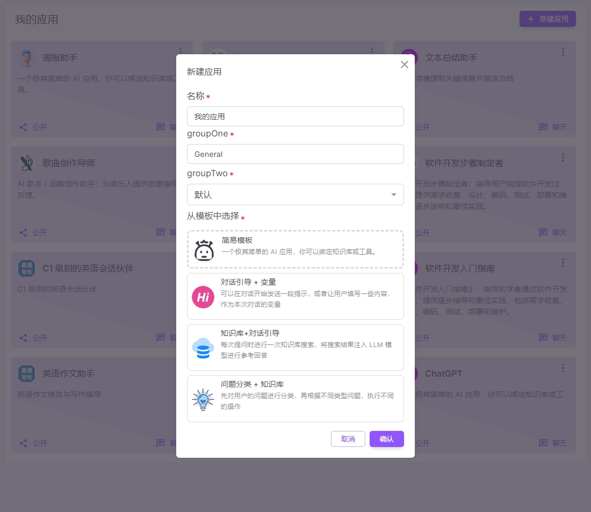
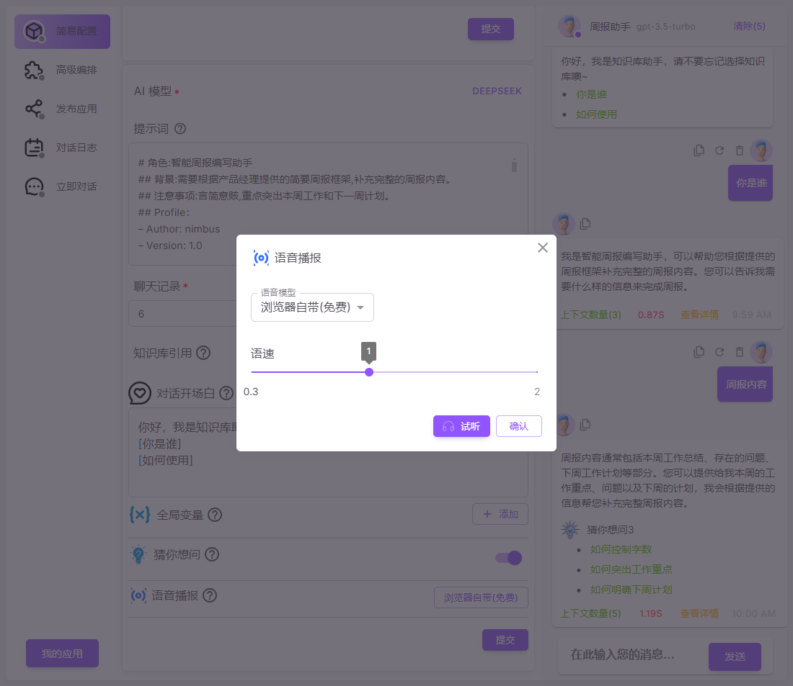
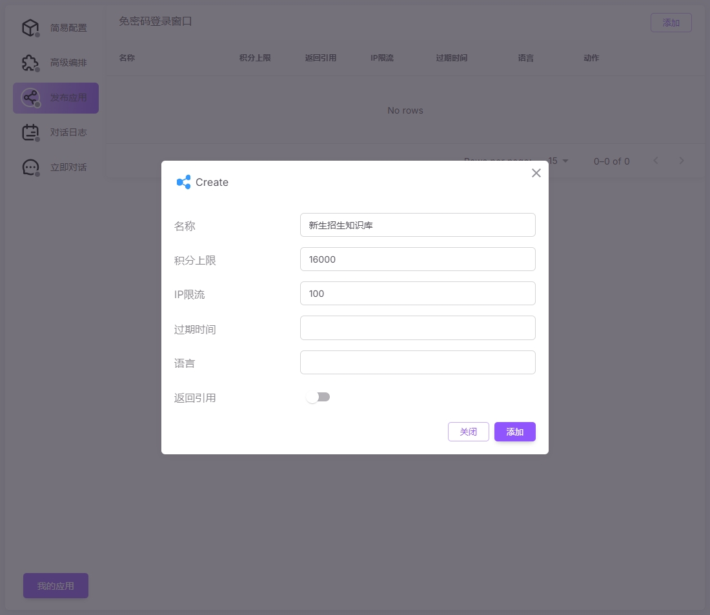
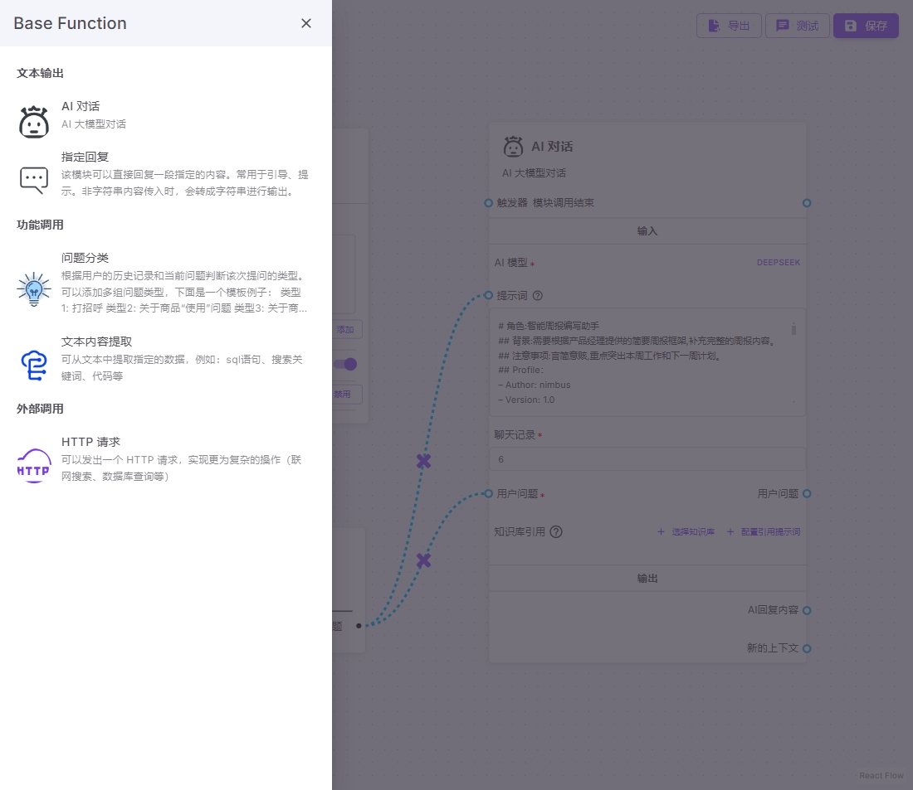
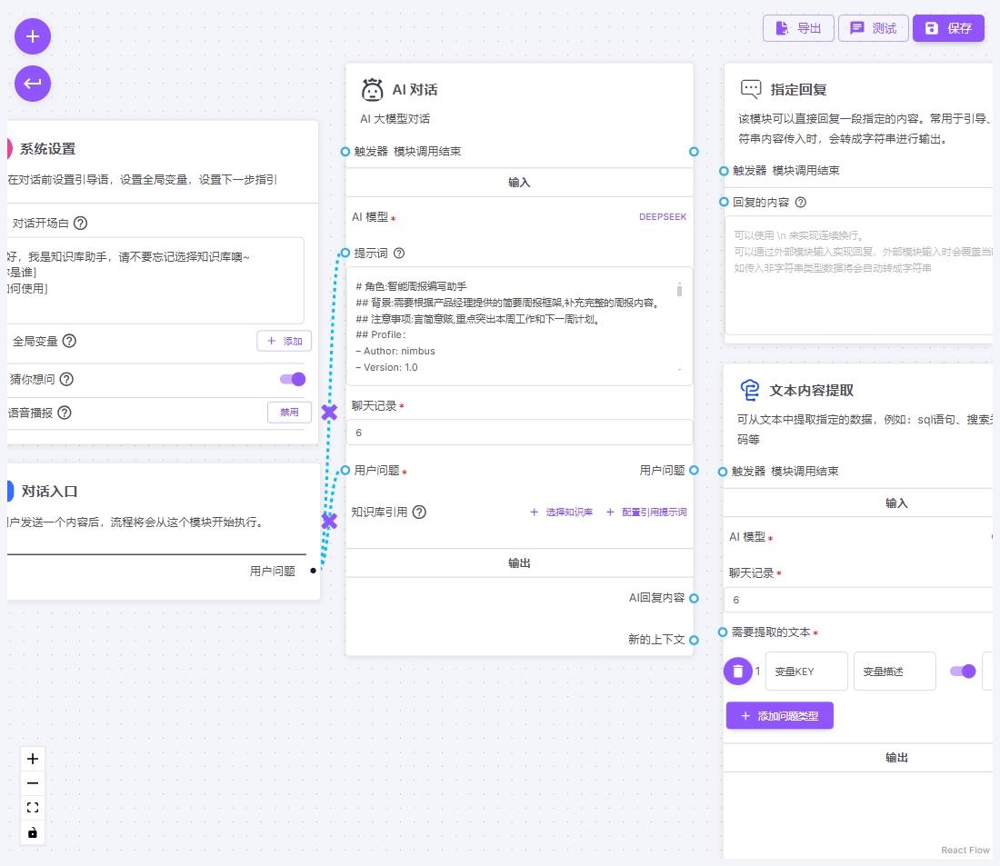
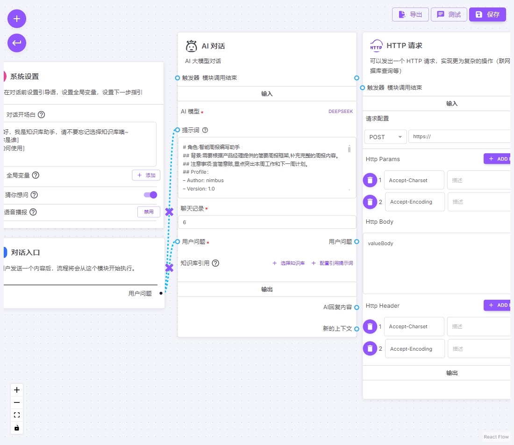

#### AI工作流

利用AI技术，可以让用户使用自然语言，来从学校的数据库中获取想要的各种结果。

根据学校的具体情况进行自由配置，从指定的数据源中获得用户想要的数据，并且可以以表格，图表的形式展示给用户.

在查询的过程中，可以查询当前用户自己的数据，也可以查询全校所有的数据(此部分仅限管理员和领导).

数据安全性: 在使用AI的过程中，AI只能接触到数据表的结构信息，不会接触到数据表的具体内容，所以不会发生数据记录泄漏给AI的情况.

##### 可以根据学校业务需要，扩充支持更多的查询模块。

|  |  |
|------------------------------------------|------------------------------------------|
|  |  |
|  |  |
|  |  |
|  |  |
|  |  |
|  | |
